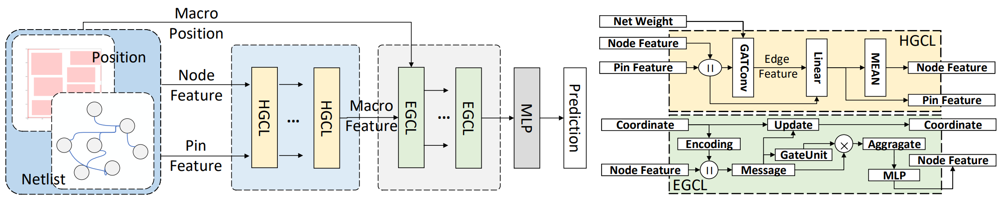

# MacroRank: Ranking Macro Placement Solutions Leveraging Translation Equivariancy

## Overview
Official implementation of our [MacroRank](https://dl.acm.org/doi/abs/10.1145/3566097.3567899), which can accurately predict the relative order of the quality of macro placement solutions.



## Download Data and Model
[Data&Model](https://drive.google.com/drive/folders/1TKHLMwHAMXxGo2zsbVSbO51Qv1Hikc8O?usp=sharing)

## Requirements
```
conda env create -f env.yaml 
```
## Test
```
bash bin/test_cnn.sh
bash bin/test_hgnn.sh
bash bin/test_ehnn.sh
bash bin/test_macrorank.sh
```
## License

This repository is released under the MIT License.

## Citation

If you think our work is useful, please feel free to cite our [paper](https://dl.acm.org/doi/abs/10.1145/3566097.3567899).

```
@inproceedings{chen2023macrorank,
    author = {Chen, Yifan and Mai, Jing and Gao, Xiaohan and Zhang, Muhan and Lin, Yibo},
    title = {MacroRank: Ranking Macro Placement Solutions Leveraging Translation Equivariancy},
    booktitle = {IEEE/ACM Asia and South Pacific Design Automation Conference (ASPDAC)},
    year = {2023},
    isbn = {9781450397834},
    publisher = {Association for Computing Machinery},
    address = {New York, NY, USA},
    url = {https://doi.org/10.1145/3566097.3567899},
    doi = {10.1145/3566097.3567899},
    pages = {258–263},
    numpages = {6},
    location = {Tokyo, Japan},
}
```

## Contact

For any questions, please do not hesitate to contact us.

```
Yifan Chen: chenyifan2019@pku.edu.cn
```
